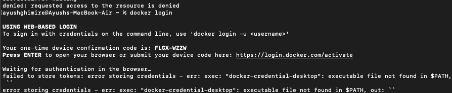

# 🚀 Fixing MLflow Docker Image for Apple Silicon (M1/M2/M3)

## ❌ Why MLflow Image Fails on MacBooks with M1/M2/M3 Chips

The official MLflow Docker image is built for **x86_64 (AMD64)** architecture, while MacBooks with **M1, M2, and M3** chips use the **ARM64** architecture. When running the official image on an Apple Silicon Mac, you may encounter errors such as:

```
exec /usr/bin/python: exec format error
```
or
```
standard_init_linux.go:228: exec user process caused: exec format error
```

These errors occur because the base image (e.g., `python:3.8`) and dependencies are not compiled for ARM64.

---

## 🛠️ Building a Compatible MLflow Docker Image

To fix this issue, we need to build a new MLflow image from the **Dockerfile** in the repository, ensuring that it supports ARM64.

### 1️⃣ Build a New Docker Image for ARM64
```sh
## If you are in the oss-mlops-platform folder
docker build ./DockerFile/mlflow 
docker buildx build --platform linux/arm64 -t myusername/mlflow-arm64:v1 .
```
🔹 Replace `myusername` with your **Docker Hub** username.  
🔹 The `--platform linux/arm64` flag ensures the image is built for Apple Silicon.

### 2️⃣ Push the Image to Docker Hub
```sh
docker login
docker push myusername/mlflow-arm64:v1
```

---

## 🚨 Fixing Docker Login Issues on Mac M1/M2/M3

If you encounter a **Docker login error** when pushing the image, it may look like this:



To fix this, modify the **config.json** file in the `.docker` directory.

1. Locate the **config.json** file:
   ```sh
   nano ~/.docker/config.json
   ```

2. Find the line:
   ```json
   "credsStore": "desktop"
   ```

3. Change it based on your OS:

   ✅ **For Mac:**  
   ```json
   "credsStore": "osxkeychain"
   ```

   ✅ **For Linux:**  
   ```json
   "credsStore": "pass"
   ```

   ✅ **For Windows (if using WSL):**  
   ```json
   "credsStore": "wincred"
   ```

Save the file and try logging in again:
```sh
docker login
```

---

## ✅ Conclusion

- The default MLflow image does not work on **Apple Silicon (ARM64)**.
- We built a new **ARM64-compatible** image using `docker buildx`.
- We pushed the image to **Docker Hub** and updated our **Kubernetes deployment**.

🚀 Now, your MLflow deployment should work on an M1/M2/M3 MacBook!
